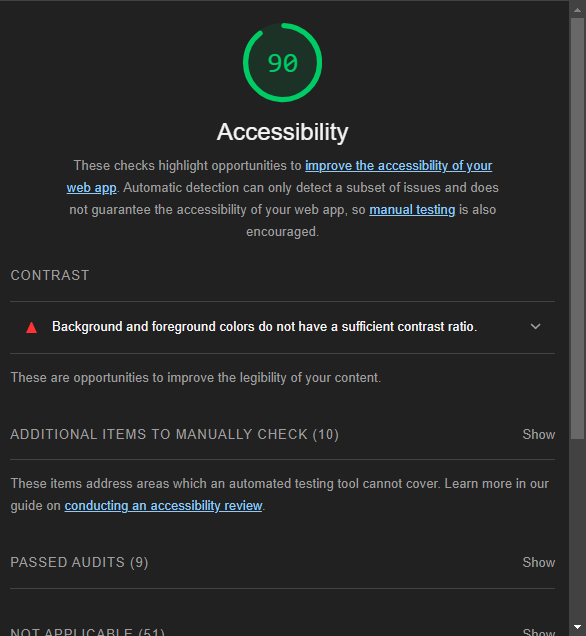
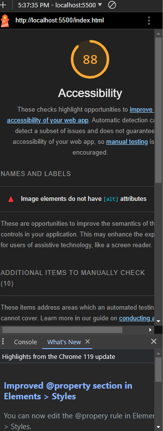

# Cookie Stand

## Cookie-Stand

I build a website to help my friend Pat sell salmon cookies!

### Author: Student/Group Name

Brendan Huddleston

### Links and Resources

* [submission PR](http://xyz.com)
* Any Links you used as reference

### Lighthouse Accessibility Report Score

### Reflections and Comments

- Pat's Salmon Cookie assignment was a pretty challenging but fun one now that we're done with it.  Making all of the data dynamic was quite the task especially with the ability to add cities into the table.
